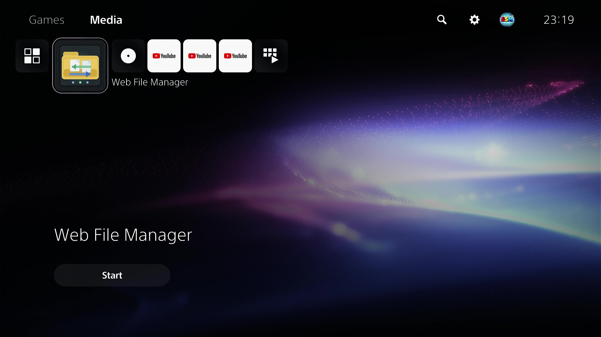
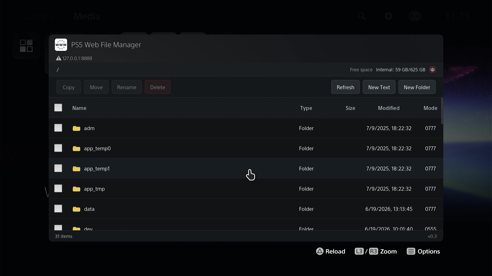
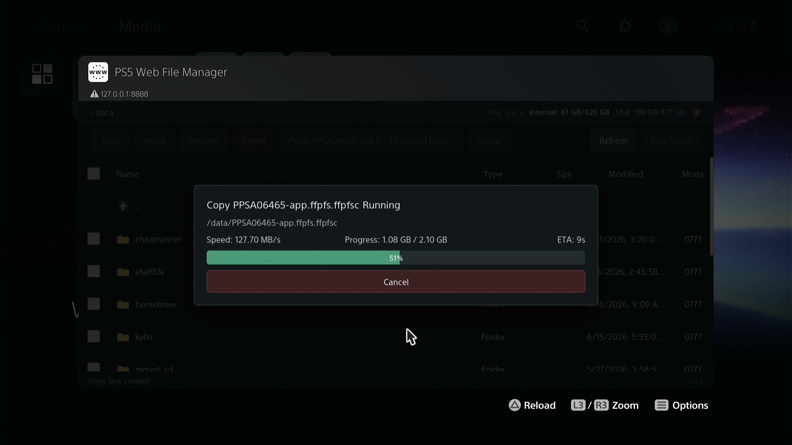
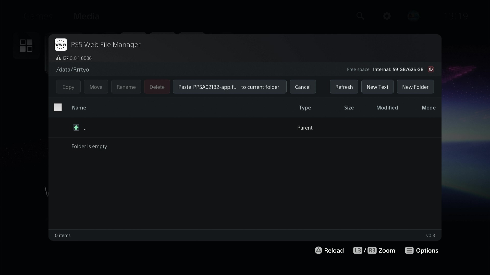
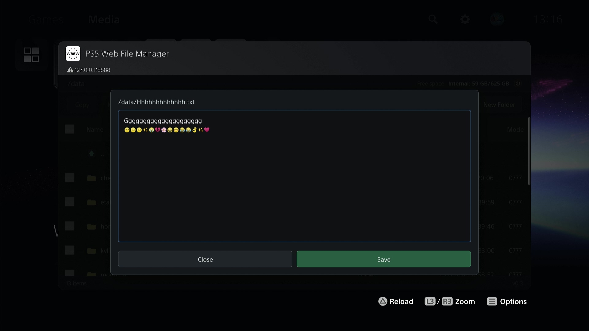
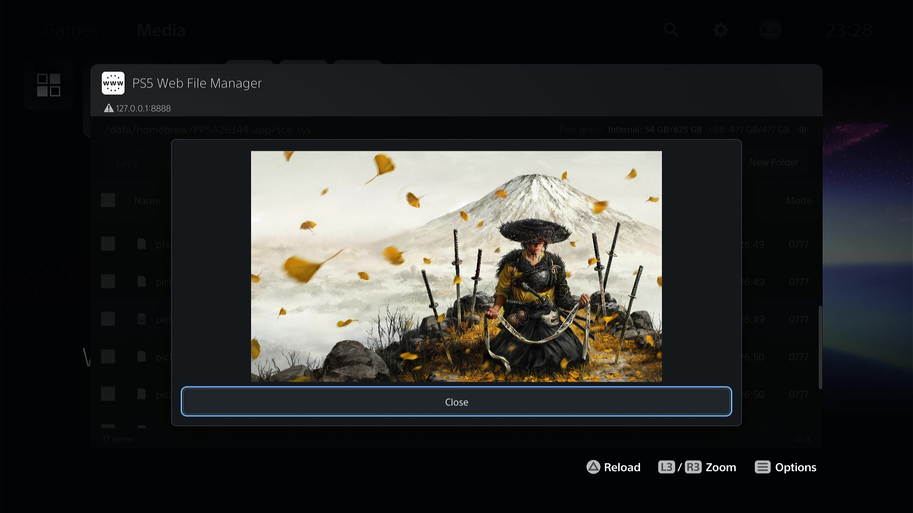

# PS5 Web File Manager

A file manager for PS5 with a web UI. It is primarily intended for quickly and
safely copying game dump folders from USB storage to internal storage.

## Brief

PS5 web file manager payload. It runs an HTTP UI starting at port `8888`, installs a home screen launcher in Media catagory on startup when needed, and provides file operations from the PS5 browser. If `8888` is already in use, the payload tries the next port until one is available; the startup notification shows the actual listen port.

## Screenshots

<p>
  <a href="docs/screenshots/20260617_231827.376.jpg" target="_blank"></a>
  <a href="docs/screenshots/20260619_131432.399.jpg" target="_blank"></a>
  <a href="docs/screenshots/20260617_232348.855.jpg" target="_blank"></a>
  <a href="docs/screenshots/20260619_131811.644.jpg" target="_blank"></a>
  <a href="docs/screenshots/20260619_131535.239.jpg" target="_blank"></a>
  <a href="docs/screenshots/20260620_232728.533.jpg" target="_blank"></a>
</p>

## Features

- List files and folders.
- Copy, move, delete, rename, and create folders.
- Edit UTF-8 text files up to 1 MiB using the built-in plain text editor.
- Multi-select operations.
- Copy/move by choosing sources first, then pasting or moving them into the current folder.
- Conflict prompts for overwriting files and merging folders.
- Full-screen task overlay with progress, speed, ETA, cancel support, and task recovery after reopening the browser while the payload process is still running.
- Copied/moved files and folders are set to `0777` where the filesystem supports Unix permissions. FAT/exFAT-style filesystems may ignore chmod.
- Chinese and English UI. The browser language is read from `navigator.languages` / `navigator.language`; Chinese uses `zh`, everything else uses English.
- Startup notification showing the app name, version, and listen port.
- Create/edit text files ending with `.txt`, `.json`, `.xml`, `.ini`, `.cfg`, `.conf`, `.md`, `.log`, `.lua`, `.js`, `.css`, `.html`, `.htm`, `.c`, `.h`, `.cpp`, `.hpp`, `.sh`, `.csv`, `.yaml`, `.yml`.
- Preview image files ending with `.png,`, `.jpg`, `.jpeg`, `.gif`, `.bmp`, `.webp`.

## Build

It depends on PS5 payload SDK first: [ps5-payload-dev/sdk](https://github.com/ps5-payload-dev/sdk#quick-start)

```sh
export PS5_PAYLOAD_SDK=/opt/ps5-payload-sdk
```

This project links against `libmicrohttpd`. `make` checks for it before building and runs the installer script automatically if it is missing:

```sh
make
```

If the build host has no network access, download the libmicrohttpd source tarball yourself and run the dependency installer once:

```sh
LIBMICROHTTPD_TARBALL=/path/to/libmicrohttpd-1.0.1.tar.gz \
  ./install-libmicrohttpd.sh
```

Then build again:

```sh
make
```

The output is:

```text
web-file-mgr.elf
```

## Usage

Start an ELF loader on the PS5. The common listener port is `9021`.

Send the built payload with netcat or NetCat GUI:

```sh
export PS5_HOST=ps5_ip_address
nc -q0 "$PS5_HOST" 9021 < web-file-mgr.elf
```

After the payload starts, the PS5 notification shows the app name, version, and actual listen port. Open the shown URL in the PS5 browser, for example:

```text
http://${PS5_IP_ADDRESS}:8888/
```

On first startup the payload installs a `PS5 Web File Manager` web shortcut in the Media category when needed. If the payload had to use a fallback port such as `8889`, use the port shown in the startup notification.

## Notes

- Copy, move, and delete run as single background tasks. While one task is running, other file operations are rejected.
- Delete is recursive and permanent. There is no recycle bin.
- Copy/move tasks can be canceled. A partially copied single file is removed, but partially copied folders are left in place to avoid deleting existing files when merging into an existing target folder.
- The UI can recover the active task display if the browser is closed and reopened while the payload process is still running.
- Text editing is limited to common text-file extensions. Non-UTF-8 and oversized files are rejected.

## FAQ
- This is a homebrew app which does not affect system process or memory. It should crash itself instead of kernel panic theoretically. If kernel panic happens, make sure you'r using the latest jailbreak methods which includes latest elfldr. Or switch back to the stable method you have been using.
- If you're using P2JB, I suggest not to use this if kernel panic happened. It is suffering to wait another 50 min because of kernel panic. Stability first for P2JB.
- The preparing stage is calculating the folder size. It would be pretty slow if there are too many files in this folder. It make sure if there is enough available space for this folder you were trying to copy/move.

## Credits

This project was built with reference to these projects:

- **[ps5-payload-dev/websrv](https://github.com/ps5-payload-dev/websrv):** HTTP server structure, static asset embedding ideas, and PS5 browser/websrv behavior. License: GPLv3+.
- **[ps5-payload-dev/ftpsrv](https://github.com/ps5-payload-dev/ftpsrv):** PS5 payload conventions, home screen launcher/install flow reference, process handling style and startup installation reference. License: GPLv3+.
- **[itsPLK/ps5-payload-manager](https://github.com/itsPLK/ps5-payload-manager):** Payload building behavior. License: GPLv3.
- **[libmicrohttpd](https://ftp.gnu.org/gnu/libmicrohttpd/):** Used as the embedded HTTP server library. It is licensed by GNU under the LGPL; this payload links it as the SDK-provided static library.
- **[ps5-payload-dev/sdk](https://github.com/ps5-payload-dev/sdk):** Payload building foundation. License: GPLv3+.

## License

The project is distributed under GPLv3 or later, matching the GPLv3+ projects used as implementation references. See `LICENSE`.

Third-party projects retain their own licenses. Do not copy assets or source from the credited projects into another distribution without preserving the corresponding license notices.

If distributing binaries, comply with the LGPL terms for libmicrohttpd in addition to this project's GPL license.
